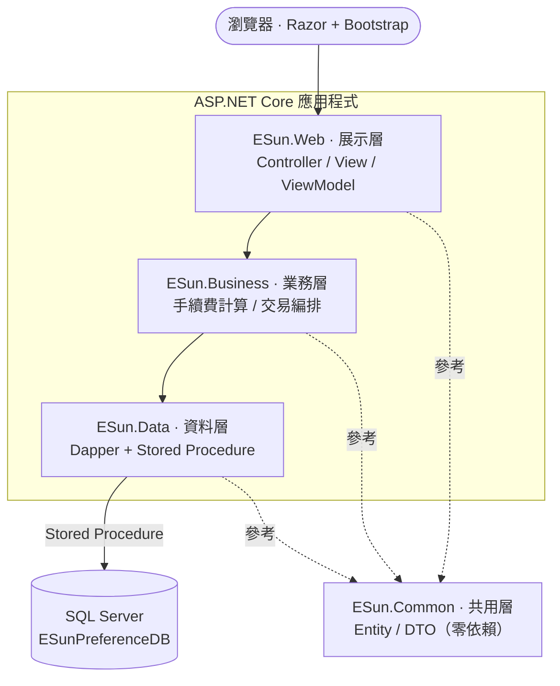
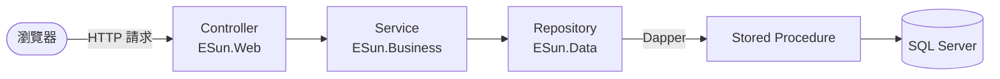

# 金融商品喜好紀錄系統

使用者可新增、查詢、更改、刪除自己「喜好的金融商品」，系統依產品價格、購買數量與手續費率，自動計算總手續費與預計扣款總金額。

---

## 功能

- **新增**喜好金融商品
- **查詢**清單：依使用者列出其喜好商品——產品名稱、產品價格、扣款帳號、購買數量、總手續費、預計扣款總金額、Email
- **更改**：修改產品資訊與扣款設定；價格／手續費率變動時自動重算金額
- **刪除**：執行前顯示唯讀確認頁
- 使用者切換：以 Session 保存目前操作者（模擬登入）
- 清單前端即時搜尋（依產品名稱篩選）

---

## 技術架構

| 項目 | 採用 |
|---|---|
| 語言／框架 | C# / ASP.NET Core 6 MVC |
| 前端 | Razor + Bootstrap 5（RWD） |
| 資料存取 | Dapper + Stored Procedure |
| 資料庫 | SQL Server Express |

### 分層（三層 + 共用層）



依賴方向：`Web → Business → Data`，`Common` 被各層參考。
展示層**不直接參考**資料層——於 `ESun.Web.csproj` 關閉傳遞性參考，任何在展示層直接使用資料層的程式碼會在**編譯期**失敗。

### 請求資料流



回應沿反向回傳：SP 結果 → DTO →（業務層計算）→ ViewModel → Razor 畫面。

---

## 專案結構

```
ESunPreferenceSystem/
├─ ESunPreferenceSystem.sln
├─ DB/
│  ├─ 01_DDL.sql               建庫、建表、Named Constraint、索引
│  ├─ 02_StoredProcedures.sql  預存程序（查詢 + 含 Transaction 的異動）
│  └─ 03_DML.sql               測試資料（3 位使用者、數筆商品）
└─ src/
   ├─ ESun.Web/                展示層
   ├─ ESun.Business/           業務層
   ├─ ESun.Data/              資料層
   ├─ ESun.Common/            共用層
   ├─ ESun.UnitTests/         單元測試（xUnit）
   └─ ESun.IntegrationTests/  整合測試（主控台程式）
```

---

## 環境需求

- **.NET 6 SDK**（本專案 target `net6.0`）
- **SQL Server Express**（預設實例 `.\SQLEXPRESS`）
- SSMS 或 Azure Data Studio（執行 SQL 腳本用）

---

## 建置與執行

### 1. 建立資料庫

於 SSMS / Azure Data Studio **依序**執行三個腳本：

```
DB/01_DDL.sql  →  DB/02_StoredProcedures.sql  →  DB/03_DML.sql
```

或使用 sqlcmd：

```bash
sqlcmd -S .\SQLEXPRESS -E -i DB\01_DDL.sql
sqlcmd -S .\SQLEXPRESS -E -i DB\02_StoredProcedures.sql
sqlcmd -S .\SQLEXPRESS -E -i DB\03_DML.sql
```

> 三個腳本皆可重複執行（re-runnable），重跑會重建結構與重置測試資料。

### 2. 確認連線字串

`src/ESun.Web/appsettings.json`：

```json
"ConnectionStrings": {
  "ESunPreferenceDB": "Server=.\\SQLEXPRESS;Database=ESunPreferenceDB;Trusted_Connection=True;TrustServerCertificate=True;MultipleActiveResultSets=True"
}
```

若你的 SQL Server 實例名稱不同，請修改 `Server=` 的部分。

### 3. 執行

```bash
dotnet run --project src/ESun.Web
```

瀏覽器開啟 **https://localhost:7165**（或主控台顯示的網址）。

### 使用方式

進入後於清單頁上方**選擇使用者**，即可對該使用者進行新增／查詢／更改／刪除。

---

## 資料模型與計算

```
User (1) ──< LikeList >── (1) Product
```

一次「新增喜好」會在**同一交易**內建立 1 筆 `Product` 與 1 筆 `LikeList`：

- `總手續費 TotalFee = 產品價格 × 購買數量 × 手續費率`
- `預計扣款總金額 TotalAmount = 產品價格 × 購買數量 + 總手續費`

計算於**業務層**進行（四捨五入採 `MidpointRounding.AwayFromZero`），結果以快照存入 `LikeList`。金額欄位一律使用 `DECIMAL`。

---

## 測試

| 專案 | 類型 | 測什麼 | 需資料庫 |
|---|---|---|---|
| `ESun.UnitTests` | xUnit 單元測試 | 業務層計算：手續費／總額、四捨五入邊界（逢五進位） | 否 |
| `ESun.IntegrationTests` | 整合測試（主控台程式） | 資料層打真實 SP：CRUD、跨表交易、越權（IDOR）防護 | 是 |

**單元測試**（不需資料庫，任何環境可執行）：

```bash
dotnet test src/ESun.UnitTests
```

**整合測試**（需先完成上方「建立資料庫」，並確保資料為初始測試資料的狀態，可重跑 `DB/03_DML.sql` 重置）：

```bash
dotnet run --project src/ESun.IntegrationTests
```

依序驗證使用者查詢、清單隔離、越權存取被擋、新增／更改的跨表交易、刪除與邊界情況，最後輸出通過／失敗統計。

---

## 安全性

| 威脅 | 防護 |
|---|---|
| SQL Injection | 全程參數化 Stored Procedure，無動態字串拼接 |
| XSS | Razor `@` 自動 HTML 編碼；不使用 `Html.Raw` |
| CSRF | 所有 POST 動作標註 `[ValidateAntiForgeryToken]`，表單自動帶防偽 token |
| 越權存取（IDOR） | UserID 一律取自 Session；查詢／異動的 SP 均以 `UserID` 限定資料範圍 |

---

## 需求對照

| 需求 | 對應實作 |
|---|---|
| C# / ASP.NET 6+ MVC | 全專案 `net6.0`，`ESun.Web` 為 ASP.NET Core MVC |
| 三層 + 共用層 | `ESun.Web` / `ESun.Business` / `ESun.Data` / `ESun.Common` |
| Razor + Bootstrap RWD | Razor Views + Bootstrap 5 |
| Stored Procedure 存取 | Dapper `CommandType.StoredProcedure`，資料層無 inline SQL |
| 多表 Transaction | 新增／更改／刪除 SP 以交易包覆 `Product` + `LikeList` |
| DDL/DML 置於 `\DB` | `DB/01_DDL.sql`、`02_StoredProcedures.sql`、`03_DML.sql` |
| 防 SQL Injection / XSS | 見「安全性」 |
